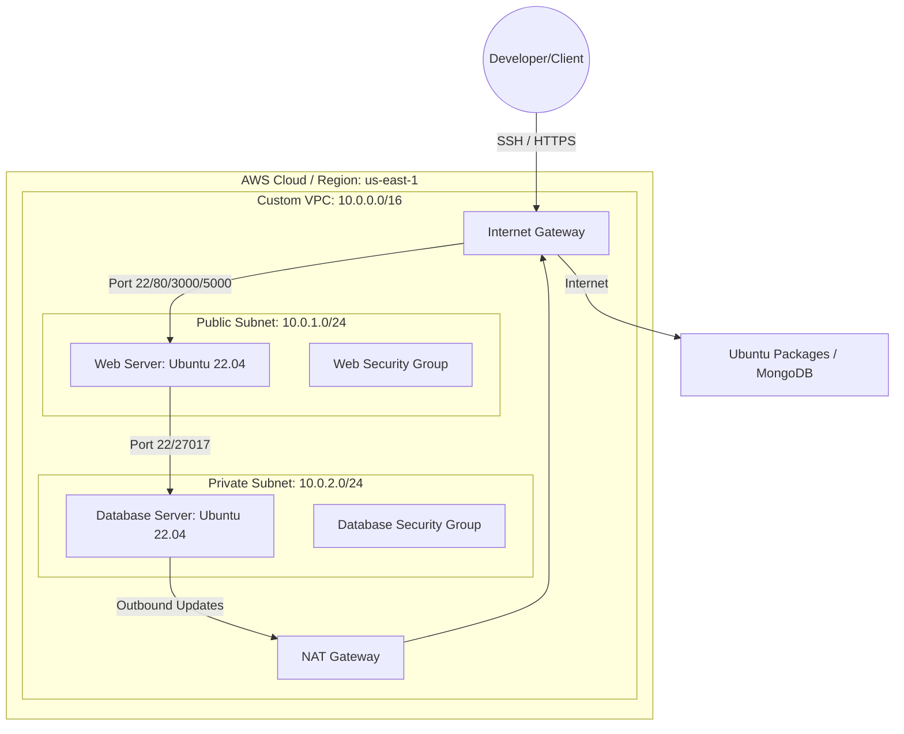
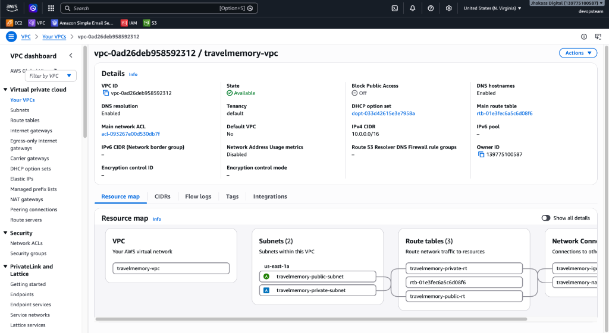
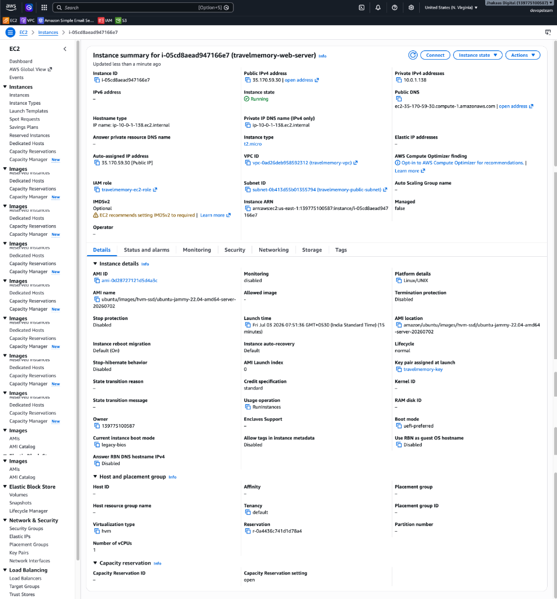
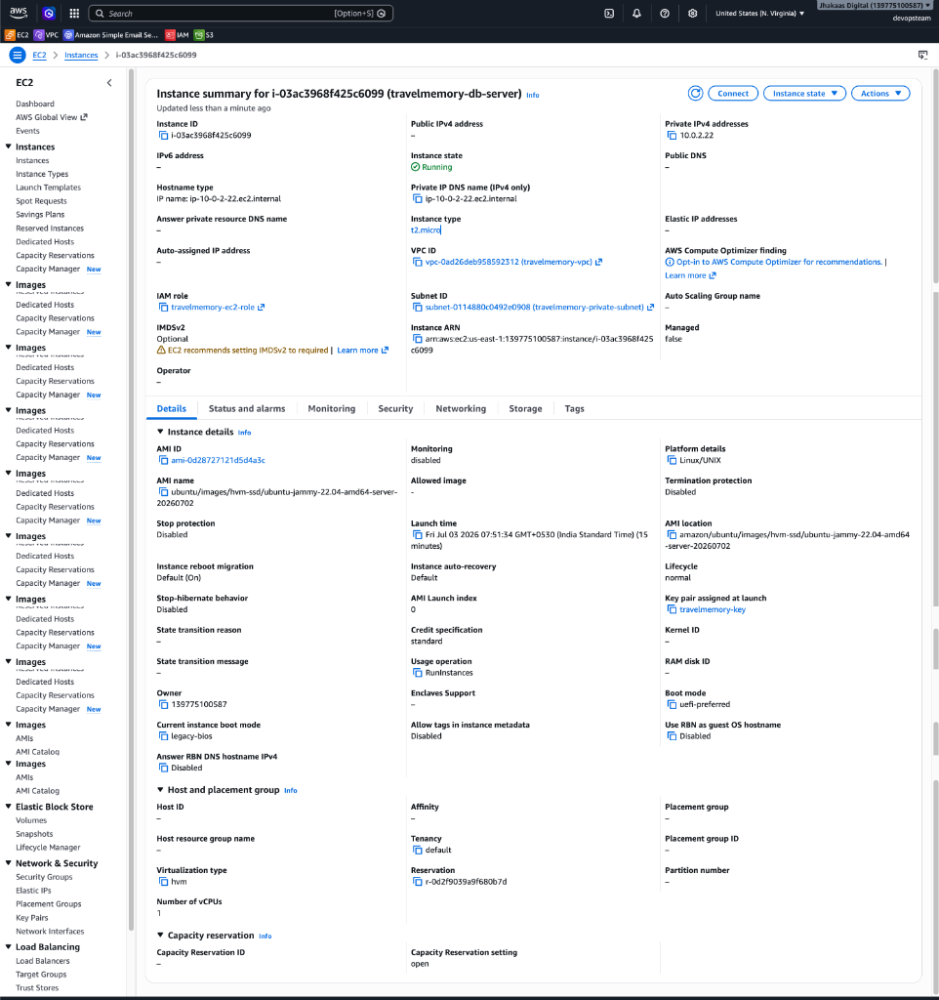

# TravelMemory Infrastructure as Code (IaC) with Terraform

This repository automates the deployment of the AWS infrastructure required to host the **TravelMemory** MERN (MongoDB, Express, React, Node.js) application. It leverages **Terraform** to implement a secure, standard-compliant two-tier network architecture.

> [!TIP]
> **Implementation Artifacts:**
> - Refer to the [Terraform Implementation Log](file:///Users/vikramhemchandar/RichyRocks/Code/Hero%20Vired%20Assignments/TravelMemory-with-IaC/implementation.md) to inspect resource creation dry-runs and details.
> - Refer to the [Ansible Configuration Log](file:///Users/vikramhemchandar/RichyRocks/Code/Hero%20Vired%20Assignments/TravelMemory-with-IaC/ansible-implementation.md) to inspect the server provisioning and application deployment logs.

---

## 🏗️ Architecture Overview

The infrastructure isolates the database in a private subnet while keeping the web application accessible in a public subnet.



### Key Components
1. **Virtual Private Cloud (VPC):** Custom CIDR block `10.0.0.0/16`.
2. **Subnets:**
   - **Public Subnet (`10.0.1.0/24`):** Hosts the Web Server. Direct route to the Internet Gateway.
   - **Private Subnet (`10.0.2.0/24`):** Hosts the MongoDB Server. Route to the internet is restricted through a NAT Gateway.
3. **Gateways:**
   - **Internet Gateway (IGW):** Enables internet access for the public subnet.
   - **NAT Gateway:** Placed in the public subnet to allow the private database instance to access the internet (e.g., for package updates) without exposing it to incoming connections.
4. **Security Groups:**
   - **Web SG:** Restricts SSH access exclusively to your detected public IP. Opens HTTP (80), HTTPS (443), React (3000), and Express (5000) to the public.
   - **DB SG:** Restricts SSH (22) and MongoDB (27017) traffic to the Web Server SG only.
5. **IAM Instance Profile:** Attaches `AmazonSSMManagedInstanceCore` to enable secure SSM session management without open ports.
6. **Key Pair Management:** Dynamically generates a secure RSA-4096 private key and saves it locally as `travelmemory-key.pem`.

---

## 📂 Project Structure

```text
TravelMemory-with-IaC/
├── terraform/
│   ├── providers.tf       # Terraform providers and version configuration
│   ├── variables.tf       # Input variables and default configurations
│   ├── vpc.tf             # Networking components (VPC, Subnets, IGW, NAT)
│   ├── security_groups.tf # Firewalls and SSH IP whitelisting
│   ├── iam.tf             # IAM roles & instance profiles for SSM
│   ├── key_pair.tf        # Automated TLS private key creation
│   ├── instances.tf       # EC2 Instance provisioning (Ubuntu 22.04 LTS)
│   └── outputs.tf         # Generated outputs (IPs, SSH commands)
├── assignment.md          # Assignment details and requirements
└── README.md              # Documentation (This file)
```

---

## ⚙️ Configuration Variables

The following variables can be customized in [terraform/variables.tf](file:///Users/vikramhemchandar/RichyRocks/Code/Hero%20Vired%20Assignments/TravelMemory-with-IaC/terraform/variables.tf) or overridden using a `terraform.tfvars` file:

| Variable Name | Description | Default Value |
| :--- | :--- | :--- |
| `aws_region` | Target AWS deployment region | `us-east-1` |
| `project_name` | Namespace suffix for resource tagging | `travelmemory` |
| `vpc_cidr` | Network IP block for the entire VPC | `10.0.0.0/16` |
| `public_subnet_cidr` | Network IP block for the public subnet | `10.0.1.0/24` |
| `private_subnet_cidr` | Network IP block for the private subnet | `10.0.2.0/24` |
| `instance_type` | Virtual hardware profile for instances | `t2.micro` |
| `allowed_ssh_cidr` | CIDR block permitted to SSH. Left blank, it auto-detects client IP. | `""` (Auto-detected) |

---

## 🚀 Step-by-Step Deployment Guide

Follow these steps to initialize and provision the infrastructure:

### 1. Prerequisites
Ensure you have the following tools installed and configured:
- **Terraform (v1.0.0+):** Check with `terraform version`.
- **AWS CLI:** Authenticated with active credentials. Verify with:
  ```bash
  aws sts get-caller-identity
  ```

### 2. Initialization
Navigate to the `terraform` directory and initialize the backend and download provider plugins:
```bash
cd terraform
terraform init
```

### 3. Verification & Planning
Validate the configuration syntax and run a dry-run execution plan:
```bash
# Verify syntax configuration is correct
terraform validate

# Inspect the blueprint of resources to be provisioned
terraform plan
```

### 4. Application
Apply the plan to build the AWS infrastructure. This process takes approximately 2-3 minutes due to NAT Gateway creation.
```bash
terraform apply -auto-approve
```

> [!WARNING]
> Do not delete or share the generated `terraform/travelmemory-key.pem` file. It contains the private key used to authenticate SSH access to both instances.

---

## 📸 AWS Resource Verification

Below are screenshots from the AWS Console showing the successfully provisioned resources:

### 1. Virtual Private Cloud (VPC) & Resource Map
The custom VPC resource map displays the subnets, public route table associated with the Internet Gateway, and private route table associated with the NAT Gateway.



### 2. Public Web Server EC2 Instance
The public-facing EC2 instance summary page highlighting the running status, public IP (`35.170.59.30`), and subnet association.



### 3. Private Database Server EC2 Instance
The database EC2 instance running in the private subnet showing its local address (`10.0.2.22`) and verifying it has no public IP assigned.



---

## 🔑 Accessing the Instances

Once provisioning completes, Terraform outputs the connection parameters.

### SSH Into the Web Server (Bastion Host)
```bash
# Make sure the key file has correct permissions
chmod 400 terraform/travelmemory-key.pem

# SSH directly to the web server
ssh -i terraform/travelmemory-key.pem ubuntu@<WEB_SERVER_PUBLIC_IP>
```

### SSH Into the Database Server (Jump Host Proxy)
Since the database resides in a private subnet, you can connect directly through the Web Server using a jump host configuration:
```bash
ssh -i terraform/travelmemory-key.pem \
    -o ProxyCommand="ssh -i terraform/travelmemory-key.pem -W %h:%p ubuntu@<WEB_SERVER_PUBLIC_IP>" \
    ubuntu@<DB_SERVER_PRIVATE_IP>
```

---

## 🛠️ Configuration & Deployment with Ansible

Ansible handles OS configurations, package installations, server hardening, database security, and application deployment across both servers.

### 📂 Ansible Structure
All files are organized under the `ansible/` folder:
```text
ansible/
├── ansible.cfg        # Operational defaults and remote user definitions
├── hosts.ini          # Inventory containing web/db servers and SSH proxy jump configs
├── group_vars/
│   └── all.yml        # Global variables (database users, ports, repo URLs)
└── playbook.yml       # Dual-play deployment automation orchestrator
```

### ⚙️ Server Hardening & Database Isolation
The deployment applies the following security policies:
1. **Database Authentication:** Configures MongoDB authentication and creates a custom application user (`traveluser`) with `readWrite` permission on the isolated `travelmemory` database.
2. **SSH Hardening:** Disables password authentication (`PasswordAuthentication no`) and root SSH logins (`PermitRootLogin no`) on both servers, enforcing keys only.
3. **Instance Firewalls:** Enables UFW and limits connections:
   - **Web Server:** Permits ports `22` (SSH), `80` (HTTP), `443` (HTTPS), `3000` (Frontend), and `3001` (Backend).
   - **DB Server:** Permits ports `22` (SSH via Jump Host) and `27017` (MongoDB from Web Server only).

---

### 📋 Running the Ansible Playbook

Follow these steps to deploy the application stack:

#### 1. Test Connections
From the project root directory, run the Ansible ping command to verify connection to both servers:
```bash
cd ansible
ansible -m ping all
```
*(You should receive a green `"ping": "pong"` for both the public `web_server` and private `db_server`.)*

#### 2. Execute Deployment Playbook
Trigger the master configuration playbook:
```bash
ansible-playbook -i hosts.ini playbook.yml
```
*(This will download Node.js, clone the MERN repository, install dependencies, compile the React build, boot both frontend and backend processes via PM2, and enable MongoDB database security.)*

---

### 🌐 Application Verification

Once execution completes, verify the running application:

#### Check PM2 Processes (on Web Server)
Connect to the web server via SSH and inspect PM2 status:
```bash
pm2 status
```
*Expected running services:*
- `travelmemory-backend` running the Node API on port `3001`.
- `travelmemory-frontend` running `serve` to deliver React static builds on port `3000`.

#### Test Web Interface
Navigate to your web server public IP address in your browser:
```text
http://<WEB_SERVER_PUBLIC_IP>:3000
```
*(Verify the frontend loads and connects successfully to the backend API.)*

---

## 🧹 Teardown

To avoid incurring ongoing charges for AWS resources (especially NAT Gateway and Elastic IP), destroy all resources when they are no longer needed:
```bash
terraform destroy -auto-approve
```
